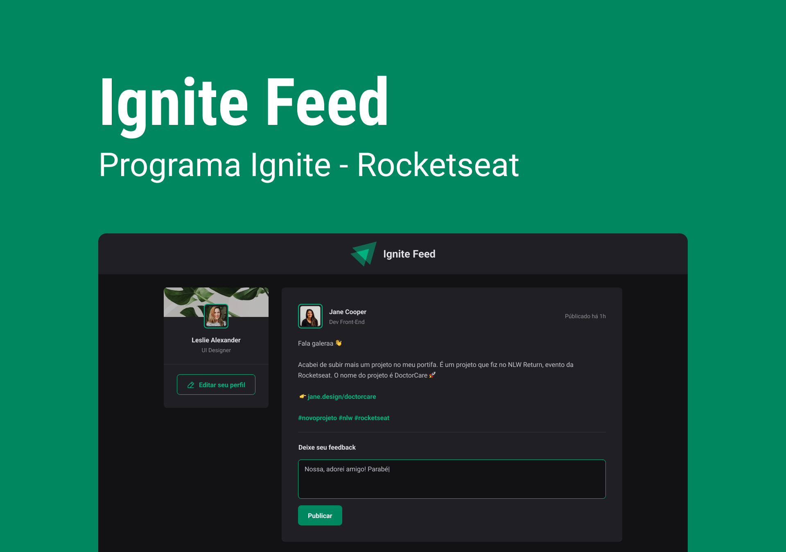

<h1> Ignite Feed </h1>

Aplicativo de Feed desenvolvido durante a Trilha ReactJS do Ignite na Rocketseat  
<a href="https://www.rocketseat.com.br/ignite">Saiba mais sobre o Ignite clicando aqui.</a>

  <a href="#-tecnologias">Tecnologias</a>&nbsp;&nbsp;&nbsp;|&nbsp;&nbsp;&nbsp;
  <a href="#-projeto">Projeto</a>&nbsp;&nbsp;&nbsp;|&nbsp;&nbsp;&nbsp;
  <a href="#-layout">Layout</a>&nbsp;&nbsp;&nbsp;|&nbsp;&nbsp;&nbsp;
  <a href="#memo-licença">Licença</a>

  

 

  

## 🚀 Tecnologias

Esse projeto foi desenvolvido com as seguintes tecnologias:

- Javascript
- Typescript
- ReactJS
- ViteJS
- CSS Module
- Figma
- Vercel

## 💻 Projeto

O Ignite Feed é um aplicativo onde pode ser feito posts, comentários, dar likes (Aplaudir) e excluir comentários.  
Esse é o primeiro projeto desenvolvido durante a Trilha Ignite de ReactJS, ele permite apenas aplausos, comentários e excluir os mesmos.

- [Acesse o deploy do projeto, na Vercel](https://florenciomath-ignitefeed.vercel.app/)

## 🔖 Layout

Você pode visualizar o layout do projeto através [DESSE LINK](https://www.figma.com/community/file/1113573231685349036). É necessário ter conta no [Figma](https://figma.com) para acessá-lo.

## :memo: Licença

Esse projeto está sob a licença MIT.

---

Feito com ♥ by Matheus Florêncio :wave: [Participe da nossa comunidade!](https://discord.gg/rocketseat)
